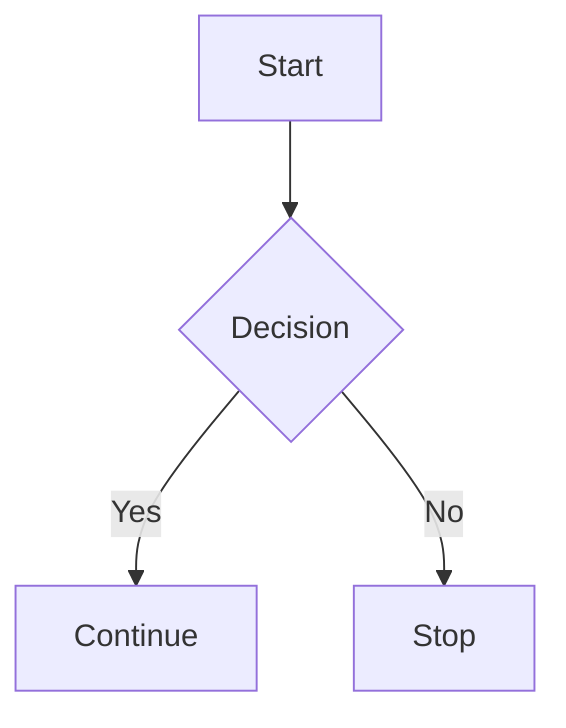
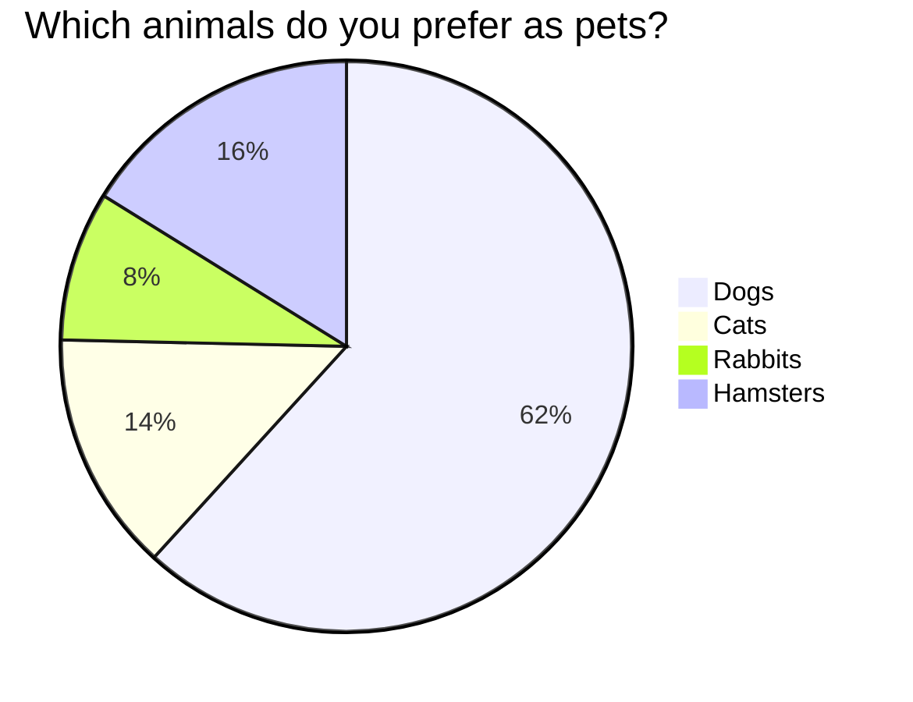

## Why it's useful in IFT3150:
> For computer science projects, visualizing algorithms, data flow, or system architecture is key. Mermaid lets students easily include diagrams without needing external images.

---

### ✅ `pymdown-extensions`

This is a collection of **enhanced Markdown extensions**, mostly used with **Material for MkDocs**. It enables:

- **Better code highlighting** with `superfences`
- **Tabs** in Markdown (`tabbed`)
- **Collapsible sections** (`details`)
- **Checkboxes** for task lists (`tasklist`)
- **Emoji support**
- **Keyboard key notation** (`keys`)
- And many more UX-friendly features

#### 🔧 Example use cases:

=== "Python"
    ```python
    def hello():
        print("Hello, world!")
    ```

=== "Java"
    ```java
    public class Hello {
        public static void main(String[] args) {
            System.out.println("Hello, world!");
        }
    }
    ```

!!! note
This is an important note for the reader.

